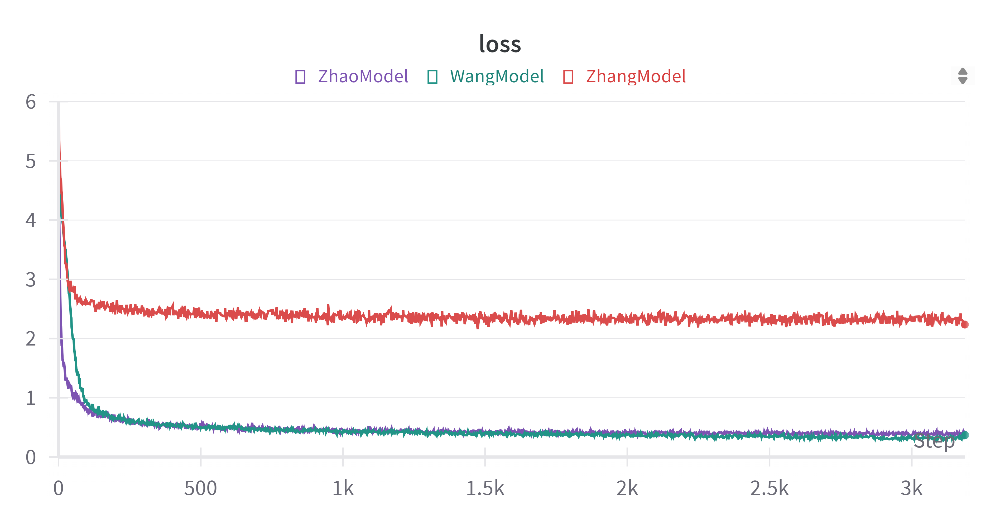
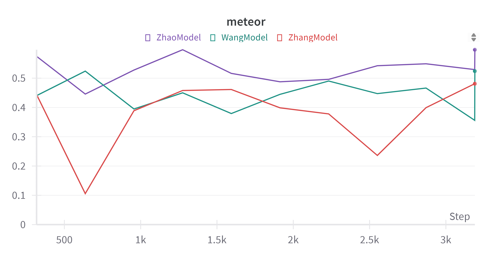
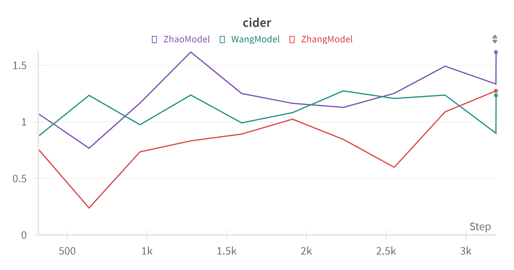
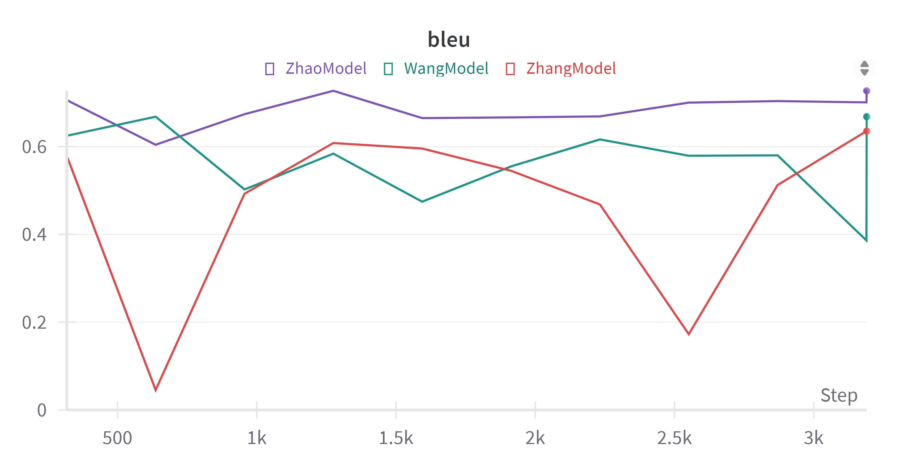
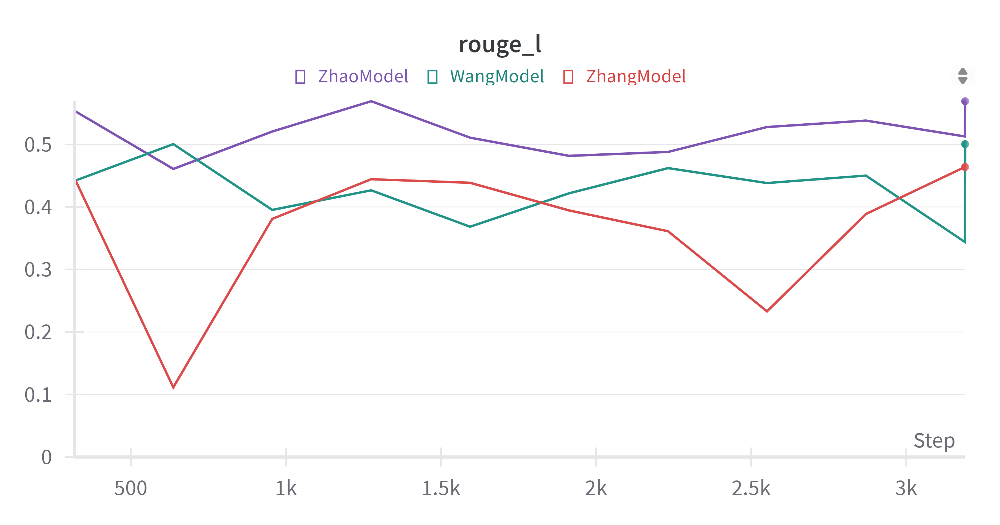

# 神经网络与深度学习课程设计结题报告

赵越2021213646    汪奕航    张子琛

报告中代码只展示关键功能，可运行的代码与相关支撑材料位于上传的文件中。

## 实验环境

Ubuntu 20.04

CUDA 11.6

python 3.10

```shell
conda create -n imagecaption python=3.10
conda init
conda activate imagecaption

conda install pytorch==1.13.1 torchvision==0.14.1 torchaudio==0.13.1 pytorch-cuda=11.6 -c pytorch -c nvidia
pip install aac_metrics==0.4.6
pip install nltk==3.5
pip install rouge==1.0.1
```

## 任务说明

基于编解码框架方法的图像描述生成任务，自动为图片生成流畅关联的自然语言描述。

## 基础任务

### 数据

数据集使用[Deepfashion-multimodal](https://github.com/yumingj/DeepFashion-MultiModal)，包含12694张服饰图片，我们按照80%的训练集与20%的测试集对其进行划分。

#### 数据预处理@赵越

我们编写了如下的代码，将deepfashion数据集转为和示例数据集flickr8k一致的格式，然后复用示例代码中构建完成分词的数据集的代码，最终得到可以用于模型训练的数据文件。

```python
def build_format_json(data_dir, tgt_name):
    json_files = glob.glob(os.path.join(data_dir, '*.json'))
    start_sentence_id = 0
    start_image_id = 0
    tgt_data = {'images':[]}

    for json_file in json_files:
        json_split = 'train' if 'train' in json_file else 'test'
        with open(json_file, 'r') as f:
            data = json.load(f)
        for img in data:
            file_name = img
            file_path = os.path.join(data_dir, file_name)
            # sentences = data[img].split('.')
            sentences = [data[img]]
            sentids = [i for i in range(start_sentence_id, start_sentence_id+len(sentences))]
            start_sentence_id += len(sentences)
            tgt_sentences = [{'raw': sent, 'tokens': sent.split(' '), 'sentid': sentid, 'imgid': start_image_id} for sent, sentid in zip(sentences, sentids)]
            tgt_data['images'].append({'filename': file_name, 'sentences': tgt_sentences, 'split': json_split})
            start_image_id += 1

    with open(os.path.join(data_dir, tgt_name), 'a') as f:
        json.dump(tgt_data, f)
        f.write('\n')
```

### 模型

这一章只给出基于相应encoder、decoder的模型代码，几种encoder、decoder的具体细节实现代码见附录。

#### CNN/ViT与GRU结合@汪奕航

// 简要描述这种模型思想

```python
class WangModel(nn.Module):
    def __init__(self, image_code_dim, vocab, word_dim, hidden_size, num_layers):
        super(WangModel, self).__init__()
        self.vocab = vocab
        self.encoder = EntireImageEncoder()
        self.decoder = GRUDecoder(image_code_dim, len(vocab), word_dim, hidden_size, num_layers)

    def forward(self, images, captions, cap_lens):
        image_code = self.encoder(images)
        return self.decoder(image_code, captions, cap_lens)
```

#### 基于自注意力的网格/区域表示@张子琛

// 简要描述这种模型思想

```python
class ZhangModel(nn.Module):
    def __init__(self, image_code_dim, vocab, word_dim, attention_dim, hidden_size, num_layers):
        super(ZhangModel, self).__init__()
        self.vocab = vocab
        self.encoder = ResImageEncoder()
        self.decoder = SelfAttentionDecoder(image_code_dim, len(vocab), word_dim, attention_dim, hidden_size, num_layers)

    def forward(self, images, captions, cap_lens):
        image_code = self.encoder(images)
        return self.decoder(image_code, captions, cap_lens)
```

#### ViT+Transformer decoder@赵越

ViT通过将图像分割为多个patch，然后将这些块线性嵌入为一维序列。用标准的Transformer模型处理这些嵌入，捕捉图像的全局特征。Transformer Decoder接收来自ViT编码的图像特征，通过注意力机制来生成目标输出。可以以标准的自回归语言模型方式进行训练。

```python
class ZhaoModel(nn.Module):
    def __init__(self, image_code_dim, vocab, word_dim, attention_dim, hidden_size, num_layers):
        super(ZhaoModel, self).__init__()
        self.vocab = vocab
        self.encoder = ViTImageEncoder(finetuned=False)
        self.decoder = TransformerDecoder(image_code_dim, len(vocab), word_dim, attention_dim, hidden_size, num_layers)

    def forward(self, images, captions, cap_lens):
        image_code = self.encoder(images)
        return self.decoder(image_code, captions, cap_lens)
```

### 评测指标

#### ROUGE-L (Recall-Oriented Understudy for Gisting Evaluation)@汪奕航

##### 原理

ROUGE-L是基于Rouge的评估自动文摘以及机器翻译的指标，特别关注于生成文本的长距离依赖和结构，计算利用了最长公共子序列。
最长公共子序列的召回和精度:

$$
R_{lcs} = \frac{LCS(X, Y)}{m}
,
P_{lcs} = \frac{LCS(X, Y)}{n}
$$

 Rouge-L指标计算公式为：

$$
F_{lcs} = \frac{(1 + \beta^2)R_{lcs}P_{lcs}}{R_{lcs} + \beta^2 P_{lcs}}
$$

X表示标准结果，Y表示模型生成结果，m表示X的长度，n表示Y的长度，LCS(X,Y)表示X,Y的最长公共子序列，超参数β通常设置较大， $R_{lcs}$ 表示召回率， $p_{lcs}$ 表示准确率.

##### 实现

```python
class ROUGEL:
    def __init__(self, beta: float = 1.2):
        super().__init__()
        self.beta = beta

    def LCS(self, seq1: List[str], seq2: List[str]) -> List[str]:
        m, n = len(seq1), len(seq2)
        dp = [[0] * (n+1) for _ in range(m+1)]
        for i in range(1, m+1):
            for j in range(1, n+1):
                if seq1[i-1] == seq2[j-1]:
                    dp[i][j] = dp[i-1][j-1] + 1
                else:
                    dp[i][j] = max(dp[i-1][j], dp[i][j-1])
        result = []
        i, j = m, n
        while i > 0 and j > 0:
            if seq1[i-1] == seq2[j-1]:
                result.append(seq1[i-1])
                i -= 1
                j -= 1
            elif dp[i-1][j] > dp[i][j-1]:
                i -= 1
            else:
                j -= 1
        result.reverse()
        return result

    def compute(self, hyp: str, ref: str) -> float:
        hyp = tokenize(hyp)
        ref = tokenize(ref)
        lcs = len(self.LCS(hyp, ref))
        try:
            P_lcs = lcs / len(hyp)
            R_lcs = lcs / len(ref)
            F_lcs = ((1 + self.beta ** 2) * R_lcs * P_lcs) / (R_lcs + self.beta ** 2 * P_lcs)
            return F_lcs
        except:
            return 0

    def __call__(self, hyp: str, refs: List[str]) -> float:
        scores = 0
        for ref in refs:
            scores += self.compute(hyp, ref)
        return scores / len(refs)
```

#### CIDEr-D  (Consensus-based Image Description Evaluation)@张子琛

##### 原理

CIDEr-D基于CIDEr，是一种专门面向于图像描述问题的指标，通过基于候选和参考句子长度之间差异的高斯惩罚与计数上的限制来使得评判标准更符合人类标准。

对于n元组 $ω_k$ ，出现在某个参考语句 $(ref)_{ij}$ 中的次数记为 $h_k(s_{ij})$ ，出现在某个候选语句 $(can)c_i$ 中的次数记为 $c_i$ ，因此这个n元组的TF-IDF表示为：

$$
g_k(s_{ij}) = \frac{h_k(s_{ij})}{\sum_{\omega_l \in \Omega} h_k(s_{ij})} \log\left(\frac{|I|}{\sum_{l_p \in I} \min(1, \sum_{q} h_k(s_{pq}))}\right)^k
$$

式中 $\omega$ 表示所有的n元组的个数，I表示所有的图片个数。

 $CIDEr_n$ 则是用来计算候选语句和参考语句在n长度的元组表示时的相似度，用公式表示为:

$$
CIDEr_n(c_i, S_i) = \frac{1}{m} \sum_j \frac{g^n(c_i) \cdot g^n(s_{ij})}{\|g^n(c_i)\| \cdot \|g^n(s_{ij})\|}
$$

对所有的 $CIDEr_n$ 取平均得到CIDEr:

$$
CIDEr(c_i, S_i) = \sum_{n=1}^{N} \omega_n CIDEr_n(c_i, S_i)
$$

CIDEr-D改进的目的是为了防止评价指标的gaming问题，首先，去除了将句子中的单词转换为原始形式这一步，让句子生成时对应的状态是对的。

在CIDEr评价指标中，对一些重复单词得到的长句子，CIDEr的分数偏高，为了减少这种影响，文章加入了高斯惩罚项：

$$
CIDEr-D_n(c_i, S_i) = \frac{10}{m} \sum_j e^{-\frac{(l(c_i) - l(s_{ij}))^2}{2\sigma^2}} \frac{\min(g^n(c_i), g^n(s_{ij})) \cdot g^n(s_{ij})}{\|g^n(c_i)\| \cdot \|g^n(s_{ij})\|}
$$

式中， $l(c_i)$ 和 $l(s_ij)$ 表示candidate和reference sentences的长度，10是为了将CIDEr-D的值和其它评价指标的值大小接近。

最终的CIDEr-D的计算公式为:

$$
CIDEr - D(c_i, S_i) = \frac{1}{N} \sum_{n=1}^{N} CIDEr - D_n(c_i, S_i)
$$

##### 实现

```python
class CIDErD:
    def __init__(self, n: int = 4, sigma: float = 6.0, scale: float = 10.0):
        self.n = n
        self.sigma = sigma
        self.scale = scale

    def compute_score(self, candidates, references, return_all_scores: bool = True, return_tfidf: bool = False):
        # 预处理
        process_cands, process_refes = self._prepare_data(candidates, references)
        # 计算打分
        score = self._compute(process_cands, process_refes, return_all_scores, return_tfidf)
        return score

    def _prepare_data(self, candidates, references):
        # 候选文本数量与参考文本数量相同
        if len(candidates) != len(references):
            raise ValueError(f"Invalid number of candidates and references. (found {len(candidates)=} != {len(references)=})")
        new_process_refes = [[self._process_sentence(ref) for ref in refs] for refs in references]
        new_process_cands = [self._process_sentence(cand) for cand in candidates]
        return new_process_cands, new_process_refes

    def _compute(self, process_cands, process_refes, return_all_scores: bool, return_tfidf: bool):
        # 至少需要两个候选文本及其对应的参考文本
        if len(process_cands) <= 1:
            raise ValueError(f"CIDEr-D metric does not support less than 2 candidates with 2 references. (found {len(process_cands)} candidates, but expected > 1)")
        # 计算参考文本中n-gram的文档频率
        doc_frequencies = self._compute_doc_freq(process_refes)
        # 候选文本的数量大于等于任何n-gram的最大文档频率
        assert len(process_cands) >= max(doc_frequencies.values()), "Sanity check failed."
        log_refs = np.log(float(len(process_refes)))
        # 计算每个候选文本与其对应参考文本之间的CIDEr-D评分
        cider_scores, tfidf_lst = self._compute_cider(process_cands, process_refes, doc_frequencies, log_refs)
        cider_score = cider_scores.mean()
        cider_scores = torch.from_numpy(cider_scores)
        cider_score = torch.as_tensor(cider_score, dtype=torch.float64)
        if return_all_scores:
            cider_outs_corpus = {"CIDEr_d": cider_score}
            cider_outs_sents = {"CIDEr_d": cider_scores}
            if return_tfidf:
                cider_outs_sents["tfidf_lst"] = tfidf_lst
            cider_outs = cider_outs_corpus, cider_outs_sents
            return cider_outs
        else:
            return cider_score

    def _process_sentence(self, sentence: str):
        words = tokenize(sentence)
        # ngram计数
        ngram_counter = Counter()
        # 生成n-gram
        for k in range(1, self.n + 1):
            for i in range(len(words) - k + 1):
                ngram = tuple(words[i : i + k])
                ngram_counter[ngram] += 1
        return ngram_counter

    def _compute_doc_freq(self, process_refes):
        doc_frequencies = Counter()
        for refs in process_refes:
            # 创建一个集合 all_refs_ngrams，包含了当前参考文本集（refs）中所有的唯一 n-gram
            all_refs_ngrams = set(ngram for ref in refs for ngram in ref.keys())
            for ngram in all_refs_ngrams:
                doc_frequencies[ngram] += 1 # 代表该n-gram在多少个不同的参考文本中出现过
        return doc_frequencies

    def _compute_cider(self, process_cands, process_refes, doc_frequencies, log_refs: float):
        scores = np.empty((len(process_cands),))
        tfidf_lst = []
        # 候选文本的n-gram计数转换为向量形式，同时计算其范数和长度
        for i, (cand, refs) in enumerate(zip(process_cands, process_refes)):
            vec, norm, length = self._counter_to_vec(cand, log_refs, doc_frequencies)
            ngrams_scores = np.zeros((len(refs), self.n))
            vec_refs = []
            # 将每个参考文本n-gram计数转换为向量，并计算其范数和长度
            for j, ref in enumerate(refs):
                vec_ref, norm_ref, length_ref = self._counter_to_vec(ref, log_refs, doc_frequencies)
                vec_refs.append(vec_ref)
                ngrams_scores[j] = self._similarity(vec, vec_ref, norm, norm_ref, length, length_ref)
            score_avg = ngrams_scores.sum(axis=0).mean() / len(refs)
            scores[i] = score_avg
            tfidf_lst.append((vec, vec_refs))
        scores = scores * self.scale
        return scores, tfidf_lst

    def _counter_to_vec(self, counters, log_refs: float, doc_frequencies):
        vec = [defaultdict(float) for _ in range(self.n)] # 存储每个n-gram的TF-IDF值
        length = 0  # 文本的长度
        norm = np.zeros((self.n,))  # 存储每个n-gram向量的范数

        for ngram, term_freq in counters.items():
            # 确定文档频率是通过映射还是函数获取的
            if isinstance(doc_frequencies, Mapping):
                count = doc_frequencies[ngram]
            else:
                count = doc_frequencies(ngram)

            log_df = np.log(max(1.0, count))
            # 根据n-gram的长度确定当前n-gram的索引
            cur_n = len(ngram) - 1
            # 计算n-gram的TF-IDF值并存储在 vec 中
            vec[cur_n][ngram] = float(term_freq) * (log_refs - log_df)
            # 更新 norm 数组，表示每个n-gram向量的范数
            norm[cur_n] += pow(vec[cur_n][ngram], 2)

            if cur_n == 1:
                length += term_freq

        norm = np.sqrt(norm)
        return vec, norm, length

    def _similarity(self, cand_vec, ref_vec, cand_norm, ref_norm, cand_len: int, ref_len: int):
        delta = int(cand_len - ref_len)
        similarities = np.zeros((self.n,))

        # 外层循环遍历不同的n-gram长度
        for ni in range(self.n):
            # 内层循环遍历候选文本的n-gram及其计数
            for ngram, count in cand_vec[ni].items():
                # 相似度计算基于候选文本和参考文本中相同n-gram的计数
                similarities[ni] += min(count, ref_vec[ni][ngram]) * ref_vec[ni][ngram]
            # 如果n-gram向量的范数不为零，则通过候选文本和参考文本的范数来标准化相似度
            if (cand_norm[ni] != 0) and (ref_norm[ni] != 0):
                similarities[ni] /= cand_norm[ni] * ref_norm[ni]
            # 长度惩罚因子
            similarities[ni] *= np.e ** (-(delta**2) / (2 * self.sigma**2))

        return similarities
```

#### METEOR (Metric for Evaluation of Translation with Explicit Ordering)@赵越

##### 原理

Meteor关注到那些翻译准确，但是与候选译文对不上的参考译文，并考虑了基于整个语料库上的准确率和召回率，利用二者的调和平均值来作为评判标准:

$$
F\ - Score = \frac{P \cdot R}{\alpha \cdot P + (1 - \alpha) \cdot R}
$$

对于词与词之间的顺序问题，该指标引入了fragmentation penalty，如果两句子中相互匹配的单词是相邻的，那么就定义为同一块（chunk），块的总数ch，frag定义为 $frag=\frac{ch}{m}$  。

因此惩罚因子定义为:

$$
Pen = \gamma \cdot frag^\beta
$$

其中 $0<\gamma<1$ ，代表惩罚的力度。

最终的Meteor的计算方式为：

$$
METEOR = (1 - Pen) \cdot F\ - Score
$$

##### 实现

```python
class Meteor:
    def __init__(self, alpha, beta, gamma):
        self.alpha = alpha
        self.beta = beta
        self.gamma = gamma
        self.stemmer = PorterStemmer()
        self.wordnet = wordnet

    # 执行基本匹配。比较假设句子（hypothesis）和参考句子（reference）中的词汇，返回匹配的词对和未匹配的词列表。
    def basic_match(self, hypo_list, refer_list):
        word_match = []
        for i in range(len(hypo_list))[::-1]:
            for j in range(len(refer_list))[::-1]:
                if hypo_list[i][1] == refer_list[j][1]:
                    word_match.append((hypo_list[i][0], refer_list[j][0]))
                    hypo_list.pop(i)[1]
                    refer_list.pop(j)[1]
                    break
        return word_match, hypo_list, refer_list

    # 执行词干匹配。使用词干提取器处理假设句子和参考句子中的词汇，然后进行匹配，返回匹配的词对和未匹配的词列表。
    def stem_match(self, hypo_list, refer_list):
        stemmed_enum_list_hypo = [(word_idx, self.stemmer.stem(word)) for word_idx, word in hypo_list]
        stemmed_enum_list_ref = [(word_idx, self.stemmer.stem(word)) for word_idx, word in refer_list]
        word_match, unmat_hypo_idx, unmat_ref_idx = self.basic_match(stemmed_enum_list_hypo, stemmed_enum_list_ref)
        unmat_hypo_indices = set(idx[0] for idx in unmat_hypo_idx)
        unmat_ref_indices = set(idx[0] for idx in unmat_ref_idx)

        hypo_list = [(idx, word) for idx, word in hypo_list if idx not in unmat_hypo_indices]
        refer_list = [(idx, word) for idx, word in refer_list if idx not in unmat_ref_indices]

        return word_match, hypo_list, refer_list

    # 使用WordNet词库查找同义词
    def get_synonyms(self, word):
        return set(lemma.name() for synset in self.wordnet.synsets(word) for lemma in synset.lemmas() if lemma.name().find("_") < 0)
    
    # 使用WordNet进行匹配。检查假设句子中的词汇是否与参考句子中的词汇或其同义词匹配，并返回匹配的词对和未匹配的词列表。
    def wordnet_match(self, hypo_list, refer_list):
        word_match = []
        for i, (hypo_idx, hypo_word) in reversed(list(enumerate(hypo_list))):
            hypothesis_syns = self.get_synonyms(hypo_word)
            hypothesis_syns.add(hypo_word)

            match_found = any(refer_word == hypo_word or refer_word in hypothesis_syns for _, refer_word in reversed(refer_list))

            if match_found:
                word_match.append((hypo_idx, refer_list[-1][0]))
                hypo_list.pop(i)
                refer_list.pop()

        return word_match, hypo_list, refer_list

    # 组合不同的匹配方法
    def match(self, hypo_list, refer_list):
        exact_matches, hypo_list, refer_list = self.basic_match(hypo_list, refer_list)
        stem_matches, hypo_list, refer_list = self.stem_match(hypo_list, refer_list)
        wns_matches, hypo_list, refer_list = self.wordnet_match(hypo_list, refer_list)

        return sorted(exact_matches + stem_matches + wns_matches, key=lambda wordpair: wordpair[0])

    # 匹配块的数量
    def chunk_num(self, matches):
        i = 0
        chunks_num = 1
        while i < len(matches) - 1:
            if matches[i + 1][0] == matches[i][0] + 1 and matches[i + 1][1] == matches[i][1] + 1:
                i += 1
                continue
            i += 1
            chunks_num += 1
        return chunks_num

    # 整合匹配、精确度、召回率、惩罚因子
    def compute(self, reference, hypothesis):
        hypo_list = list(enumerate(hypothesis.lower().split()))
        refer_list = list(enumerate(reference.lower().split()))
        hypo_len = len(hypo_list)
        refer_len = len(refer_list)
        matches = self.match(hypo_list, refer_list)
        matches_num = len(matches)
        if matches_num == 0:
            return 0
        precision = matches_num / hypo_len
        recall = matches_num / refer_len
        fmean = precision * recall / (self.alpha * precision + (1 - self.alpha) * recall)
        chunk_num = self.chunk_num(matches)
        frag_frac = chunk_num / matches_num
        penalty = self.gamma * frag_frac ** self.beta
        meteor_score = (1 - penalty) * fmean
        return meteor_score

    def __call__(self, references, hypothesis):
        scores = [self.compute(reference, hypothesis) for reference in references]
        return max(scores)
```

## 拓展任务

由于生成式大语言模型的突破性进展，Haotian Liu等人构建了一种通用的视觉语言模型LLaVA，用户可以传入一张图片然后与模型对话。LLaVA在过滤出的595K CC3M上进行了预训练对齐视觉语言特征，并在158K指令微调数据上进行SFT，获得了较强的视觉-语言知识，因此我们考虑利用模型的基础能力，在deepfashion数据集上进行lora微调，并且用微调后的模型构造新的数据集用于小模型训练，期望以数据的形式将大模型能力蒸馏到小模型。

### 模型

LLaVA@clip-vit-large-patch14 & Vicuña-13b

### 蒸馏方案设计

#### 将现有deepfashion数据集转为LLaVA训练格式@赵越

```python
def process(src, tgt):
    data = read_json(src)
    tgt_format_data = []
    for image, caption in tqdm(data.items()):
        basename = os.path.basename(image)
        image_id = basename.replace('.jpg', '')
        tgt_format_data.append({
            'id': image_id,
            'image': basename,
            'conversations': [
                {
                    'from': 'human',
                    'value': 'Please describe this image in deepfashion dataset style.'
                },
                {
                    'from': 'gpt',
                    'value': caption
                }
            ]
        })
    save_json(tgt_format_data, tgt)
```

#### lora微调@赵越


```shell
#!/bin/bash

PROMPT_VERSION=v1
MODEL_VERSION="vicuna-13b"

deepspeed llava/train/train_mem.py \
    --deepspeed ./scripts/zero2.json \
    --lora_enable True \
    --model_name_or_path ./checkpoint/$MODEL_VERSION \
    --version $PROMPT_VERSION \
    --data_path /data/CourseProject/data/deepfashion/train_data_llava.json \
    --image_folder /data/CourseProject/data/deepfashion/images \
    --vision_tower /data/CLIP/clip-vit-large-patch14 \
    --pretrain_mm_mlp_adapter ./checkpoint/llava-$MODEL_VERSION-pretrain/mm_projector.bin \
    --mm_vision_select_layer -2 \
    --mm_use_im_start_end False \
    --mm_use_im_patch_token False \
    --bf16 True \
    --output_dir ./checkpoint/llava-$MODEL_VERSION-finetune_lora \
    --num_train_epochs 1 \
    --per_device_train_batch_size 16 \
    --per_device_eval_batch_size 4 \
    --gradient_accumulation_steps 1 \
    --evaluation_strategy "no" \
    --save_strategy "steps" \
    --save_steps 5000 \
    --save_total_limit 1 \
    --learning_rate 2e-5 \
    --weight_decay 0. \
    --warmup_ratio 0.03 \
    --lr_scheduler_type "cosine" \
    --logging_steps 1 \
    --tf32 True \
    --model_max_length 2048 \
    --gradient_checkpointing True \
    --lazy_preprocess True \
    --dataloader_num_workers 4 \
    --report_to wandb

```

#### 数据集构建@汪奕航

```python
def main(args):
    # Model
    disable_torch_init()

    model_name = get_model_name_from_path(args.model_path)
    tokenizer, model, image_processor, context_len = load_pretrained_model(args.model_path, args.model_base, model_name, args.load_8bit, args.load_4bit)

    if 'llama-2' in model_name.lower():
        conv_mode = "llava_llama_2"
    elif "v1" in model_name.lower():
        conv_mode = "llava_v1"
    elif "mpt" in model_name.lower():
        conv_mode = "mpt"
    else:
        conv_mode = "llava_v0"

    if args.conv_mode is not None and conv_mode != args.conv_mode:
        print('[WARNING] the auto inferred conversation mode is {}, while `--conv-mode` is {}, using {}'.format(conv_mode, args.conv_mode, args.conv_mode))
    else:
        args.conv_mode = conv_mode

    for img in tqdm(data['images']):
        inp = 'Please describe this image in deepfashion dataset style.'
        path = os.path.join(image_folder, img['filename'])
        conv = conv_templates[args.conv_mode].copy()

        image = load_image(path)
        image_tensor = image_processor.preprocess(image, return_tensors='pt')['pixel_values'].half().cuda()
        # print(f"Image: {path}")
        if image is not None:
            # first message
            if model.config.mm_use_im_start_end:
                inp = DEFAULT_IM_START_TOKEN + DEFAULT_IMAGE_TOKEN + DEFAULT_IM_END_TOKEN + '\n' + inp
            else:
                inp = DEFAULT_IMAGE_TOKEN + '\n' + inp
            conv.append_message(conv.roles[0], inp)
            image = None
        else:
            # later messages
            conv.append_message(conv.roles[0], inp)
        conv.append_message(conv.roles[1], None)
        prompt = conv.get_prompt()

        input_ids = tokenizer_image_token(prompt, tokenizer, IMAGE_TOKEN_INDEX, return_tensors='pt').unsqueeze(0).cuda()
        stop_str = conv.sep if conv.sep_style != SeparatorStyle.TWO else conv.sep2
        keywords = [stop_str]
        stopping_criteria = KeywordsStoppingCriteria(keywords, tokenizer, input_ids)
        # streamer = TextStreamer(tokenizer, skip_prompt=True, skip_special_tokens=True)
        streamer = None

        with torch.inference_mode():
            output_ids = model.generate(
                input_ids,
                images=image_tensor,
                do_sample=True,
                temperature=0.9,
                max_new_tokens=200,
                streamer=streamer,
                use_cache=True,
                stopping_criteria=[stopping_criteria])

        outputs = tokenizer.decode(output_ids[0, input_ids.shape[1]:]).strip()
        conv.messages[-1][-1] = outputs
        img['sentences'][0]['raw'] = outputs
        img['sentences'][0]['tokens'] = outputs.split(' ')
        if args.debug:
            print("\n", {"prompt": prompt, "outputs": outputs}, "\n")
```

#### 利用新的数据集训练@张子琛

```python
global_step = 0
for epoch in range(start_epoch, config.num_epochs):
    now_step = 0
    for i, (imgs, caps, caplens) in enumerate(train_loader):
        optimizer.zero_grad()
        # 1. 读取数据至GPU
        imgs = imgs.to(device)
        caps = caps.to(device)
        caplens = caplens.to(device)

        # 2. 前馈计算
        predictions, alphas, sorted_captions, lengths, sorted_cap_indices = model(imgs, caps, caplens)
        # 3. 计算损失
        # captions从第2个词开始为targets
        loss = loss_fn(predictions, sorted_captions[:, 1:], lengths)
        # 重随机注意力正则项，使得模型尽可能全面的利用到每个网格
        # 要求所有时刻在同一个网格上的注意力分数的平方和接近1
        loss += config.alpha_weight * ((1. - alphas.sum(axis=1)) ** 2).mean()

        loss.backward()
        # 梯度截断
        if config.grad_clip > 0:
            nn.utils.clip_grad_norm_(model.parameters(), config.grad_clip)
        # 4. 更新参数
        optimizer.step()

        wandb.log({"loss": loss.cpu()})
        
        global_step += 1
        now_step += 1

    state = {
            'epoch': epoch,
            'step': now_step,
            'model': model,
            'optimizer': optimizer
            }
    rouge_l, cider, meteor, bleu = evaluate(valid_loader, model, config, metriclogger, global_step)
    # 5. 选择模型
    print(rouge_l, cider, meteor, bleu)
    print(best_rougel, best_cider, best_meteor, best_bleu)
    if np.mean([rouge_l, cider, meteor, bleu]) > np.mean([best_rougel, best_cider, best_meteor, best_bleu]):
        best_rougel, best_cider, best_meteor, best_bleu = rouge_l, cider, meteor, bleu
        torch.save(state, config.best_checkpoint)

    torch.save(state, config.last_checkpoint)
```

## 实验结果

### loss



### meteor



### cider



### bleu



### rouge



## 实验结果分析

### 对loss的讨论

### 对指标的讨论

|                                     | bleu         | cider        | meteor       | rouge        |
| ----------------------------------- | ------------ | ------------ | ------------ | ------------ |
| resnet101整体表示+gru               | <u>0.668</u> | 1.235        | <u>0.524</u> | <u>0.501</u> |
| renet101网格表示+self attention gru | 0.635        | <u>1.275</u> | 0.481        | 0.464        |
| vit_b_16+transformer decoder        | **0.727**    | **1.618**    | **0.597**    | **0.569**    |


## 附录

### ImageEncoder实现

#### resnet整体表示@汪奕航

```python
class EntireImageEncoder(nn.Module):
    def __init__(self, finetuned=True):
        super(EntireImageEncoder, self).__init__()
        model = torchvision.models.resnet101(weights=ResNet101_Weights.DEFAULT)
        self.grid_rep_extractor = nn.Sequential(*(list(model.children())[:-1]))
        for param in self.grid_rep_extractor.parameters():
            param.requires_grad = finetuned

    def forward(self, images):
        out = self.grid_rep_extractor(images).reshape(-1, 2048)
        return out
```

#### resnet局部表示@张子琛

```python
class ResImageEncoder(nn.Module):
    def __init__(self, finetuned=True):
        super(ResImageEncoder, self).__init__()
        model = torchvision.models.resnet101(weights=ResNet101_Weights.DEFAULT)
        # ResNet-101网格表示提取器
        self.grid_rep_extractor = nn.Sequential(*(list(model.children())[:-2]))
        for param in self.grid_rep_extractor.parameters():
            param.requires_grad = finetuned
        
    def forward(self, images):
        out = self.grid_rep_extractor(images) 
        return out
```

#### vit整体表示@赵越

```python
class ViTImageEncoder(nn.Module):
    def __init__(self, finetuned=True):
        super(ViTImageEncoder, self).__init__()
        self.model = vit_b_16(weights=ViT_B_16_Weights.DEFAULT)
        # self.model = self.model.encoder
        # finetune?
        if not finetuned:
            for param in self.model.parameters():
                param.requires_grad = False
        
    def forward(self, images):
        x = self.model._process_input(images)
        n = x.shape[0]

        batch_class_token = self.model.class_token.expand(n, -1, -1)
        x = torch.cat([batch_class_token, x], dim=1)

        out = self.model.encoder(x)
        return out
```

### LanguageDecoder实现

#### gru decoder@汪奕航

```python
class GRUDecoder(nn.Module):
    def __init__(self, image_code_dim, vocab_size, word_dim, hidden_size, num_layers, dropout=0.5):
        super(GRUDecoder, self).__init__()
        self.embed = nn.Embedding(vocab_size, word_dim)
        self.hidden_size = hidden_size
        self.rnn = nn.GRU(word_dim + image_code_dim, hidden_size, num_layers)
        self.fc = nn.Linear(hidden_size, vocab_size)
        self.dropout = nn.Dropout(p=dropout)
        self.init_state = nn.Linear(image_code_dim, num_layers * hidden_size)
        self.init_weights()

    def init_weights(self):
        self.embed.weight.data.uniform_(-0.1, 0.1)
        self.fc.bias.data.fill_(0)
        self.fc.weight.data.uniform_(-0.1, 0.1)

    def init_hidden_state(self, image_code, captions, cap_lens):
        """
        参数：
            image_code：图像编码器输出的图像表示
                        (batch_size, image_code_dim)
        """
        batch_size = captions.size(0)
        # （1）按照caption的长短排序
        sorted_cap_lens, sorted_cap_indices = torch.sort(cap_lens, 0, True)
        captions = captions[sorted_cap_indices]
        image_code = image_code[sorted_cap_indices]
        # （2）初始化隐状态
        hidden_state = self.init_state(image_code)
        hidden_state = hidden_state.view(
            batch_size,
            self.rnn.num_layers,
            self.rnn.hidden_size).permute(1, 0, 2)
        return image_code, captions, sorted_cap_lens, sorted_cap_indices, hidden_state

    def forward_step(self, image_code, curr_cap_embed, hidden_state):
        # （3.1）以图像整体表示和当前时刻词表示为输入，获得GRU输出
        x = torch.cat((image_code, curr_cap_embed), dim=-1).unsqueeze(0)
        # x: (1, real_batch_size, hidden_size + word_dim)
        # out: (1, real_batch_size, hidden_size)
        out, hidden_state = self.rnn(x, hidden_state)
        # （3.2）获取该时刻的预测结果
        # (real_batch_size, vocab_size)
        preds = self.fc(self.dropout(out.squeeze(0)))
        return preds, hidden_state

    def forward(self, image_code, captions, cap_lens):
        """
        参数：
            hidden_state: (num_layers, batch_size, hidden_size)
            image_code:  (batch_size, image_code_dim)
            captions: (batch_size, )
        """
        # （1）将图文数据按照文本的实际长度从长到短排序
        # （2）获得GRU的初始隐状态
        image_code, captions, sorted_cap_lens, sorted_cap_indices, hidden_state \
            = self.init_hidden_state(image_code, captions, cap_lens)
        batch_size = image_code.size(0)
        # 输入序列长度减1，因为最后一个时刻不需要预测下一个词
        lengths = sorted_cap_lens.cpu() - 1
        # 初始化变量：模型的预测结果和注意力分数
        predictions = torch.zeros(batch_size, lengths[0], self.fc.out_features).to(captions.device)
        # 获取文本嵌入表示 cap_embeds: (batch_size, num_steps, word_dim)
        cap_embeds = self.embed(captions)
        # Teacher-Forcing模式
        for step in range(lengths[0]):
            # （3）解码
            # （3.1）模拟pack_padded_sequence函数的原理，获取该时刻的非<pad>输入
            real_batch_size = torch.where(lengths > step)[0].shape[0]
            preds, hidden_state = self.forward_step(
                image_code[:real_batch_size],
                cap_embeds[:real_batch_size, step, :],
                hidden_state[:, :real_batch_size, :].contiguous())
            # 记录结果
            predictions[:real_batch_size, step, :] = preds
        return predictions, captions, lengths, sorted_cap_indices
```

#### self attention gru decoder@张子琛

```python
class SelfAttentionDecoder(nn.Module):
    def __init__(self, image_code_dim, vocab_size, word_dim, attention_dim, hidden_size, num_layers, num_heads=1, dropout=0.5):
        super(SelfAttentionDecoder, self).__init__()
        self.embed = nn.Embedding(vocab_size, word_dim)
        self.attention = AdditiveAttention(hidden_size, image_code_dim, attention_dim)
        self.init_state = nn.Linear(image_code_dim, num_layers*hidden_size)
        self.rnn = nn.GRU(word_dim + image_code_dim, hidden_size, num_layers)
        self.dropout = nn.Dropout(p=dropout)
        self.fc = nn.Linear(hidden_size, vocab_size)
        self.self_attention = nn.MultiheadAttention(hidden_size, num_heads, dropout)
        self.init_weights()
        
    def init_weights(self):
        self.embed.weight.data.uniform_(-0.1, 0.1)
        self.fc.bias.data.fill_(0)
        self.fc.weight.data.uniform_(-0.1, 0.1)
    
    def init_hidden_state(self, image_code, captions, cap_lens):
        """
        参数：
            image_code：图像编码器输出的图像表示 
                        (batch_size, image_code_dim, grid_height, grid_width)
        """
        # 将图像网格表示转换为序列表示形式 
        batch_size, image_code_dim = image_code.size(0), image_code.size(1)
        if image_code.dim() == 4:
            # -> (batch_size, grid_height, grid_width, image_code_dim) 
            image_code = image_code.permute(0, 2, 3, 1)  
            # -> (batch_size, grid_height * grid_width, image_code_dim)
            image_code = image_code.view(batch_size, -1, image_code_dim)
        # （1）按照caption的长短排序
        sorted_cap_lens, sorted_cap_indices = torch.sort(cap_lens, 0, True)
        captions = captions[sorted_cap_indices]
        image_code = image_code[sorted_cap_indices]
         #（2）初始化隐状态
        hidden_state = self.init_state(image_code.mean(axis=1))
        hidden_state = hidden_state.view(
                            batch_size, 
                            self.rnn.num_layers, 
                            self.rnn.hidden_size).permute(1, 0, 2)
        return image_code, captions, sorted_cap_lens, sorted_cap_indices, hidden_state

    def forward_step(self, image_code, curr_cap_embed, hidden_state):
        #（3.2）利用注意力机制获得上下文向量
        # query：hidden_state[-1]，即最后一个隐藏层输出 (batch_size, hidden_size)
        # context: (batch_size, hidden_size)
        context, alpha = self.attention(hidden_state[-1], image_code)
        #（3.3）以上下文向量和当前时刻词表示为输入，获得GRU输出
        x = torch.cat((context, curr_cap_embed), dim=-1).unsqueeze(0)
        # x: (1, real_batch_size, hidden_size+word_dim)
        # out: (1, real_batch_size, hidden_size)
        out, hidden_state = self.rnn(x, hidden_state)
        #（3.4）获取该时刻的预测结果
        # (real_batch_size, vocab_size)
        out, _ = self.self_attention(out, out, out)
        preds = self.fc(self.dropout(out.squeeze(0)))
        return preds, alpha, hidden_state
        
    def forward(self, image_code, captions, cap_lens):
        """
        参数：
            hidden_state: (num_layers, batch_size, hidden_size)
            image_code:  (batch_size, feature_channel, feature_size)
            captions: (batch_size, )
        """
        # （1）将图文数据按照文本的实际长度从长到短排序
        # （2）获得GRU的初始隐状态
        image_code, captions, sorted_cap_lens, sorted_cap_indices, hidden_state \
            = self.init_hidden_state(image_code, captions, cap_lens)
        batch_size = image_code.size(0)
        # 输入序列长度减1，因为最后一个时刻不需要预测下一个词
        lengths = sorted_cap_lens.cpu() - 1
        # 初始化变量：模型的预测结果和注意力分数
        predictions = torch.zeros(batch_size, lengths[0], self.fc.out_features).to(captions.device)
        alphas = torch.zeros(batch_size, lengths[0], image_code.shape[1]).to(captions.device)
        # 获取文本嵌入表示 cap_embeds: (batch_size, num_steps, word_dim)
        cap_embeds = self.embed(captions)
        # Teacher-Forcing模式
        for step in range(lengths[0]):
            #（3）解码
            #（3.1）模拟pack_padded_sequence函数的原理，获取该时刻的非<pad>输入
            real_batch_size = torch.where(lengths>step)[0].shape[0]
            preds, alpha, hidden_state = self.forward_step(
                            image_code[:real_batch_size], 
                            cap_embeds[:real_batch_size, step, :],
                            hidden_state[:, :real_batch_size, :].contiguous())            
            # 记录结果
            predictions[:real_batch_size, step, :] = preds
            alphas[:real_batch_size, step, :] = alpha
        return predictions, alphas, captions, lengths, sorted_cap_indices
```

#### transformer decoder@赵越

```python
class TransformerDecoder(nn.Module):
    def __init__(self, image_code_dim, vocab_size, word_dim, attention_dim, hidden_size, num_layers, dropout=0.5,nhead=4):
        super(TransformerDecoder, self).__init__()
        self.embed = nn.Embedding(vocab_size, word_dim)
        self.hidden_size = hidden_size
        self.nhead = nhead
        self.decoder_layers = nn.TransformerDecoderLayer(d_model=hidden_size, nhead=self.nhead, dim_feedforward=hidden_size)
        self.decoder = nn.TransformerDecoder(self.decoder_layers, num_layers=num_layers)
        self.fc = nn.Linear(hidden_size, vocab_size)
        self.dropout = nn.Dropout(p=dropout)
        self.init_weights()

    def init_weights(self):
        self.embed.weight.data.uniform_(-0.1, 0.1)
        self.fc.bias.data.fill_(0)
        self.fc.weight.data.uniform_(-0.1, 0.1)

    def forward(self, image_code, captions, cap_lens=None):
        batch_size = captions.size(0)
        if cap_lens is not None:
            sorted_cap_lens, sorted_cap_indices = torch.sort(cap_lens, 0, True)
            sorted_cap_lens = sorted_cap_lens.cpu() - 1
            captions = captions[sorted_cap_indices]
            image_code = image_code[sorted_cap_indices]
        else:
            sorted_cap_lens = None
            sorted_cap_indices = None
        hidden_state = image_code.permute(1, 0, 2) # (batch_size, visual_seq_length, hidden_size)
        captions_embed = self.embed(captions)  # (batch_size, max_seq_length, word_dim)

        captions_embed = self.dropout(captions_embed)
        memory = hidden_state.repeat(self.decoder.num_layers, 1, 1)  # (num_layers, batch_size, hidden_size)

        tgt_mask = self.generate_square_subsequent_mask(captions.size(1)).to(captions.device)

        output = self.decoder(captions_embed.permute(1, 0, 2), memory, tgt_mask=tgt_mask)

        output = self.fc(output.permute(1, 0, 2))  # (batch_size, max_seq_length, vocab_size)

        return output, None, captions, sorted_cap_lens, sorted_cap_indices
        
	# 确保在每个时间步只能访问到当前和之前的位置
    @staticmethod
    def generate_square_subsequent_mask(sz):
        mask = torch.triu(torch.ones(sz, sz) * float('-inf'), diagonal=1)
        return mask
```

